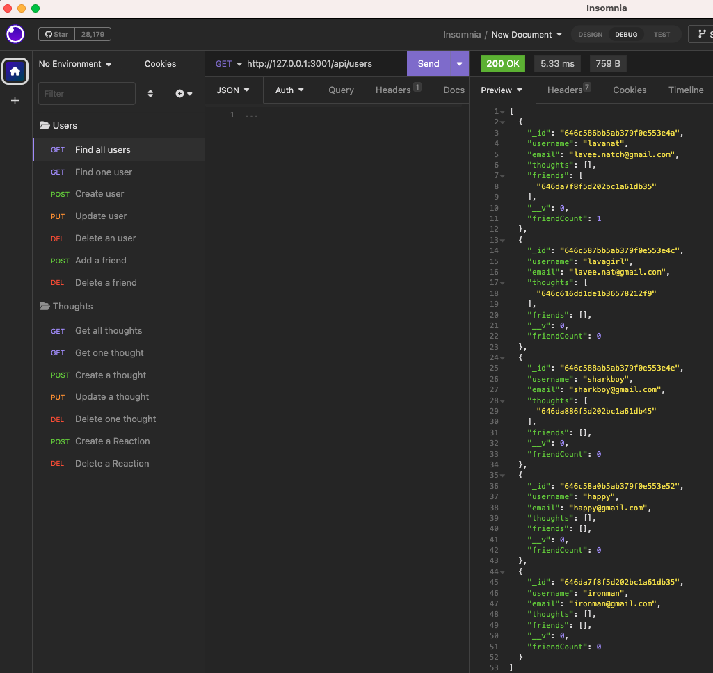

# social-network-api
an API for a social network web application where users can share their thoughts, react to friends’ thoughts, and create a friend list

## Description

Users can perform a variety of actions on a social network application such as creating, deleting, and updating users, adding and deleting friends, creating, deleting, and updating thoughts, and adding and deleting reactions to thoughts.

## Usage

You can use this application to manage an API for a social network application

## Link to Video Walkthrough

[Video Walkthrough](https://drive.google.com/file/d/1YBw6sXFDdBaxWIRJ5OjUidi1UKOa31-J/view?usp=sharing)

## Screenshot of Application

